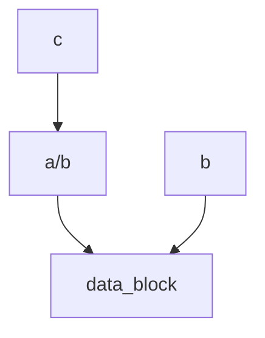

# Dotfiles

## 硬链接与软链接

硬链接（Hard Link）是指多个文件名指向同一个物理数据块的链接。当创建一个硬链接时，实际上是在文件系统中创建了一个新的目录项，该目录项指向相同的inode（索引节点），inode中包含了文件的元数据和数据块的位置。因此，无论是原始文件还是硬链接文件，它们都指向相同的数据块，对其中一个文件的修改会影响到其他文件。硬链接只能链接到同一个文件系统中的文件，不能跨文件系统链接。

符号链接（Symbolic Link），也称为软链接（Soft Link），是指创建一个特殊的文件，该文件包含了指向目标文件或目录的路径。符号链接实际上是一个指向目标文件的快捷方式，类似于Windows中的快捷方式。符号链接文件有自己的inode，其中记录了目标文件的路径信息。当访问符号链接文件时，系统会根据该文件的路径信息找到目标文件。符号链接可以链接到不同文件系统中的文件。

` $ ln -P a/b c` 创建一个名为c的硬链接, 与a/b这个文件共享同一个数据块

`$ ln -s a/b b` 创建一个名为b的符号链接, 指向a/b这个文件

> 总结一下，硬链接和符号链接的区别如下：
>
> 1. 数据块：硬链接和原始文件共享相同的数据块，而符号链接是一个指向目标文件的路径。
> 2. 文件系统：硬链接只能链接到同一个文件系统中的文件，而符号链接可以链接到不同文件系统中的文件。
> 3. 修改影响：对硬链接或原始文件的修改会影响到其他文件，而对符号链接的修改不会影响到目标文件。
> 4. 文件类型：硬链接是一个普通文件，而符号链接是一个特殊的文件。
>
> 需要注意的是，删除原始文件不会影响硬链接文件或符号链接文件的存在，但删除硬链接文件不会影响原始文件或其他硬链接文件，而删除符号链接文件会导致无法访问目标文件。

## 配置文件(Dotfiles)

很多程序的配置都是通过纯文本格式的被称作*点文件*的配置文件来完成的（之所以称为点文件，是因为它们的文件名以 `.` 开头，例如 `~/.vimrc`。也正因为此，它们默认是隐藏文件，`ls`并不会显示它们）。

shell 的配置也是通过这类文件完成的。在启动时，您的 shell 程序会读取很多文件以加载其配置项。根据 shell 本身的不同，您从登录开始还是以交互的方式完成这一过程可能会有很大的不同。关于这一话题，[这里](https://blog.flowblok.id.au/2013-02/shell-startup-scripts.html) 有非常好的资源

对于 `bash`来说，在大多数系统下，您可以通过编辑 `.bashrc` 或 `.bash_profile` 来进行配置。在文件中您可以添加需要在启动时执行的命令，例如上文我们讲到过的别名，或者是您的环境变量。

实际上，很多程序都要求您在 shell 的配置文件中包含一行类似 `export PATH="$PATH:/path/to/program/bin"` 的命令，这样才能确保这些程序能够被 shell 找到。

还有一些其他的工具也可以通过*点文件*进行配置：

- `bash` - `~/.bashrc`, `~/.bash_profile`
- `git` - `~/.gitconfig`
- `vim` - `~/.vimrc` 和 `~/.vim` 目录
- `ssh` - `~/.ssh/config`
- `tmux` - `~/.tmux.conf`

我们应该如何管理这些配置文件呢，它们应该在它们的文件夹下，并使用版本控制系统进行管理，然后通过脚本将其 **符号链接** 到需要的地方。这么做有如下好处：

- **安装简单**: 如果您登录了一台新的设备，在这台设备上应用您的配置只需要几分钟的时间；
- **可移植性**: 您的工具在任何地方都以相同的配置工作
- **同步**: 在一处更新配置文件，可以同步到其他所有地方
- **变更追踪**: 您可能要在整个程序员生涯中持续维护这些配置文件，而对于长期项目而言，版本历史是非常重要的

这里有很多[dotfile仓库]([Repository search results (github.com)](https://github.com/search?o=desc&q=dotfiles&s=stars&type=Repositories)), [这里](https://dotfiles.github.io/) 也有一些非常有用的资源.
